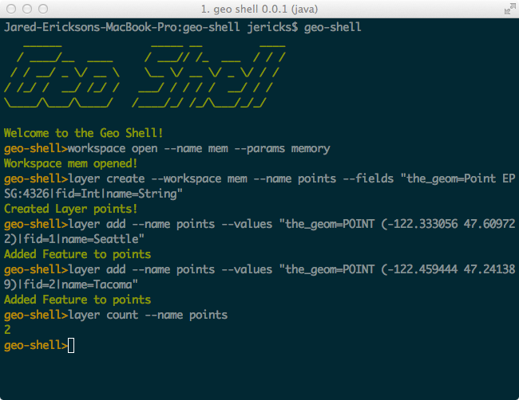

.. image:: https://travis-ci.org/jericks/geo-shell.svg?branch=master
    :target: https://travis-ci.org/jericks/geo-shell

geo-shell
---------
geo-shell is an interactive shell for geospatial analysis. 

geo-shell support vector, raster, and tile datasets and includes a map module.

Behind the scenes it uses GeoScript Groovy, GeoTools, and JTS.

You can use geo-shell interactively by typing **geo-shell** at the command line.

Or you can write scripts and then execute them from the command line by typing **geo-shell --cmdfile script.txt**

Or by using the **script --file script.txt** command within a geo-shell session.

Example
-------
$ geo-shell

geo-shell>workspace open --name shps --params /Users/you/Projects/NaturalEarth/LargeScale/10m_cultural

   Workspace shps opened!

geo-shell>workspace layers --name shps

   10m_admin_0_breakaway_disputed_areas

   10m_admin_1_states_provinces_lines_shp

   10m_us_parks_line

   10m_admin_0_scale_ranks_with_minor-islands

   10m_admin_0_boundary_lines_maritime_indicator

   10m_admin_0_boundary_breakaway_disputed_areas

geo-shell>layer open --workspace shps --layer 10m_roads

Commands
--------
geo-shell is based on spring-shell and inherits several useful built in commands:

exit = exit the shell

quit = exit the shell

help = list all commands and their usages

help workspace open = list help for a specific command

! = run os command string

date = displays local date and time

script = run a script

system properties = show shell's properties

version = display current cli version

download --url url --file file

unzip --file file.zip --directory dir

open --file file

workspace
---------
workspace open --name shps --params /Users/you/shps

workspce close --name shps

workspace list --name shps

workspace layers --name shps

layer 
-----
layer open --workspace shps --layer states --name us_states

layer close --name us_states

layer list

layer schema --name us_states

layer features --name us_states --filter "NAME='Washington'"

layer count --name us_states

layer remove --workspace shps --layer states

layer create --workspace shps --name points --fields "the_geom=Point EPSG:4326|id=Int|name=String"

layer add --name points --values "the_geom=POINT (1 1)|id=1|name=Seattle"

layer delete --name states --filter "area > 500"

layer copy --input-name states --output-workspace layers.gpkg --output-name countries

layer style set --name us_states --style states.sld

layer style get --name us_states --style states.sld

layer addfields --input-name points --output-workspace directory --output-name points_xy --fields "xcol=Double,ycol=Double"

layer removefields --input-name points_xy --output-workspace mem --output-name points_no_xy --fields xcoord,ycoord

layer updatefield --name points_fields --field wkt --value 'return f.geom.wkt' --script true

layer addareafield --input-name us_states --output-workspace postgis --output-name states_area --area-fieldname area

layer addidfield --input-name us_states --output-workspace postgis --output-name states_area --id-fieldname id --start-value 1

layer addxyfields --input-name points --output-workspace postgis --output-name points_xy --x-fieldname xcoord --y-fieldname ycoord

layer buffer --input-name us_states --output-workspace postgis --output-name states_buffered --distance 10

layer centroid --input-name us_states --output-workspace postgis --output-name states_centroids

layer interiorpoint --input-name us_states --output-workspace postgis --output-name states_interiorpoints

layer random --output-workspace postgis --output-name points --number 100 --geometry 0,0,45,45

layer grid rowcol --output-workspace layers --output-name grid --rows 10 --columns 10 --geometry -180,-90,180,90

layer grid widthheight --output-workspace layers --output-name grid --width 20 --height 15 --geometry -180,-90,180,90

layer extent --input-name polygons --output-workspace memory --output-name extent

layer extents --input-name polygons --output-workspace memory --output-name extents

layer convexhull --input-name polygons --output-workspace memory --output-name convexhull

layer convexhulls --input-name polygons --output-workspace memory --output-name convexhulls

layer delaunay --input-name points --output-workspace mem --output-name delaunay

layer voronoi --input-name points --output-workspace mem --output-name voronoi

layer mincircle --input-name polygons --output-workspace memory --output-name mincircle

layer mincircles --input-name polygons --output-workspace memory --output-name mincircles

layer minrect --input-name polygons --output-workspace memory --output-name minrect

layer minrects --input-name polygons --output-workspace memory --output-name minrects

layer octagonalenvelope --input-name polygons --output-workspace memory --output-name octagonalenvelope

layer octagonalenvelopes --input-name polygons --output-workspace memory --output-name octagonalenvelopes

layer simplify --input-name polys --output-workspace directory --output-name simplified --algorithm tp --distance 120

layer densify --input-name polys --output-workspace postgis --output-name polys_densified --distance 10

layer transform --input-name points --output-workspace mem --output-name polys --transforms "the_geom=buffer(the_geom, 2)|id=id*10"

layer reproject --input-name states --output-workspace postgis --output-name states_merc --projection EPSG:3857

layer clip --input-name cities --clip-name state --output-workspace dir --output-name cities_states

layer union --input-name wetlands --other-name floodplain --output-workspace dir --output-name waterlogged

layer intersection --input-name parcels --other-name floodplain --output-workspace postgis --output-name parcels_floodplain

layer erase --input-name parcels --other-name zones --output-workspace shps --output-name parcel_zones

layer identity --input-name parcels --other-name zones --output-workspace shps --output-name parcel_zones_identity

layer update --input-name a:a --other-name b:b --output-workspace mem --output-name a_b_update

layer symdifference --input-name a:a --other-name b:b --output-workspace mem --output-name a_b_symdifference

layer dissolve --input-name states --output-workspace mem --output-name regions --field SUB_REGION

tile
----
tile open --name states --params states.mbtiles

tile close --name states

tile list

tile info --name states

tile generate --name states --map states_map --start 0 --end 4

tile stitch raster --name osm --format osm_bounds --raster osm_bounds --bounds "-102.360992,47.126213,-100.390320,47.819610,EPSG:4326"

tile vector grid --name osm --workspace gpkg --layer gridz --z 1

tile tiles --name osm --bounds "2315277.538707974,4356146.199006655,2534193.2172859586,4470343.227121928" --z 10

tile delete --name osm --z 1

format
------
format open --name earth --input earth.tif

format close --name earth

format list

format rasters --name earth

raster
------
raster open --format earth --raster earth

raster close --name earth

raster list

raster info --name earth

raster value --name earth --x 10 --y 15 --type pixel

raster crop --name earth --output-format cropped_earth --output-name cropped_earth --geometry 0,0,45,45

raster reproject --name earth --output-format earth_reprojected --output-name earth-reprojected --projection EPSG:4326

raster style set --name earth --style earth.sld

raster style get --name earth --style earth.sld

raster contour --name raster --output-workspace mem --output-name contours --band 0 --levels 74,100,120,140,160,180,200,220,240,252

raster envelope --name earth --output-workspace earth_outline --output-name earth_outline

raster reclassify --name raster --output-format reclassified --output-name reclassified --band 0 --ranges "0-185=1,185-200=2,200-255=3"

raster scale --name raster --output-format scaled --output-name scaled --x 2 --y 3 --interpolation bicubic

raster add constant --name raster --output-format raster10 --output-name raster10 --values 10

raster add raster --name1 topo --name2 deposits --output-format topo_new --output-name topo_new

raster subtract constant --name raster --output-format rasterMinus10 --output-name rasterMinus10 --values 10

raster subtract raster --name1 erosion --name2 topo --output-format topo_new --output-name topo_new

raster multiply constant --name raster --output-format rasterTimes10 --output-name rasterTimes10 --values 10

raster multiply raster --name1 topo --name2 height --output-format topo_new --output-name topo_new

raster divide constant --name raster --output-format rasterDividedBy2 --output-name rasterDividedBy2 --values 2

raster divide raster --name1 topo --name2 reduce --output-format topo_new --output-name topo_new

raster stylize --name raster --output-format raster_stylized --output-name raster_stylized

style
-----
style create --params "stroke=navy stroke=width=5" --file earth_outline.sld

style vector default --layer naturalearth:countries --color #a5bfdd --file ocean_blue.sld

style vector uniquevalues --layer naturalearth:states --field NAME_1  --colors random --file states_name.sld

style vector gradient --layer naturalearth:states --field population --number 8 --colors blues --file states_pop.sld

style raster default --raster raster --opacity 0.75 --file raster.sld

style raster colormap --raster raster --values "10=red,50=blue,100=wheat,250=white" --type ramp --opacity 0.75 --file raster_colormap.sld

map
---
map open --name state_map

map close --name state_map

map list

map layers --name state_map

map add layer --name state_map --layer states

map add raster --name state_map --raster usa_dem

map add tile --name state_map --tile osm

map remove layer --name state_map --layer states

map reorder --name state_map --layer states --order first | last | up | down | 1 | 2

map draw --name state_map --bounds 0,0,100,100

map display --name state_map --bounds 0,0,100,100

License
-------
geo-shell is open source and licensed under the MIT License.
